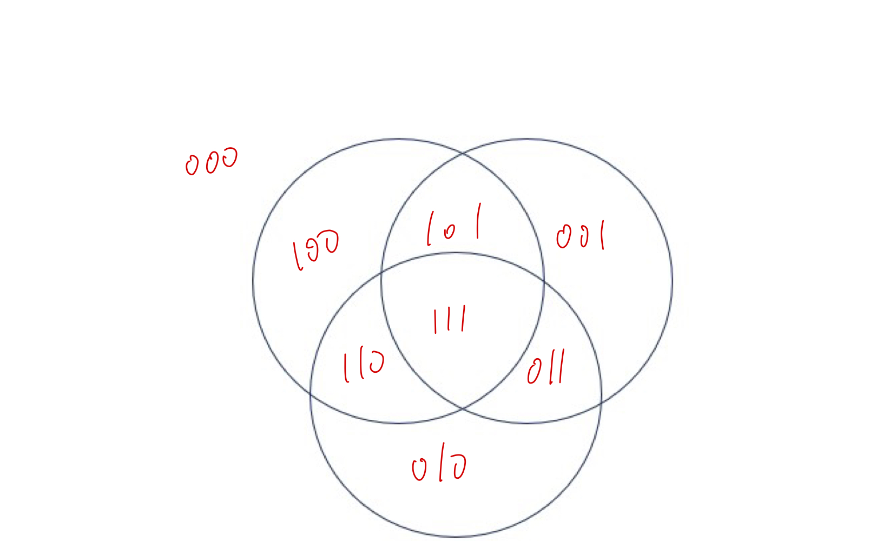
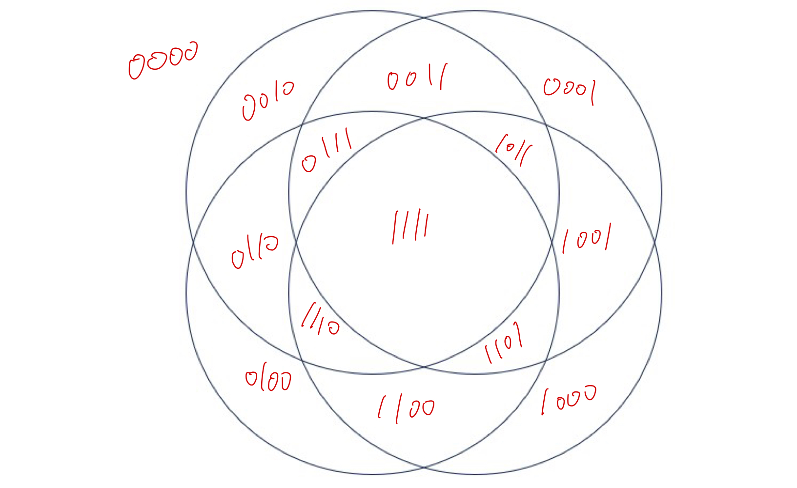

## HW0
Yutong Guo 
A16269813  
1. I have completed the survey.
2. 
   (a) I think each circle is labeled with a unique binary code with 2 bit, and their overlap is labeled with the sum of the two labels. 
   (b)  
   (c)  
   (d) There are 2 codes (1010, 0101) missing from the Venn diagram with 4 circles. Since there are 14 regions including the region outside, and there are 16 unique 4-bit binary strings, there should be 16 regions including the region outside in order to have each 4-bit binary string used exactly once. 
   (e) I think this Venn diagram is better than the one with circles. Although it looks really messy, it solves the problem by having 16 regions, including the outside region. The Venn diagram with circles is missing the occasion where only the opposite vertices circles overlap, which is gladly solved by the Venn diagram with ellipse.
3. Computing the first few terms: 
   $a_1  = \left\lfloor \sqrt{2(1)} + 0.5 \right\rfloor = 1$  
   $a_2  = \left\lfloor \sqrt{2(2)} + 0.5 \right\rfloor = 2$  
   $a_3  = \left\lfloor \sqrt{2(3)} + 0.5 \right\rfloor = 2$  
   $a_4  = \left\lfloor \sqrt{2(4)} + 0.5 \right\rfloor = 3$  
   $a_7  = \left\lfloor \sqrt{2(7)} + 0.5 \right\rfloor = 4$  
   $a_{10}  = \left\lfloor \sqrt{2(10)} + 0.5 \right\rfloor = 4$  
   $a_{11}  = \left\lfloor \sqrt{2(12)} + 0.5 \right\rfloor = 5$ 

   From the above, the pattern is that $\( a_n \)$ starts at 1 for the first term, then becomes 2 for the next two terms, then 3 for the following three terms, and so on.
4. First, break the chocolate bar in half vertically to create two 4x4 squares. Then, each of the 4x4 squares can be split in half vertically to produce two 4x2. Then, split each of the 4x2 in half vertically to get 4x1. Finally, break each of the 4x1 strips horizontally, one chunk at a time. This would sum up to 1+2+4+24=31 total breaks.

